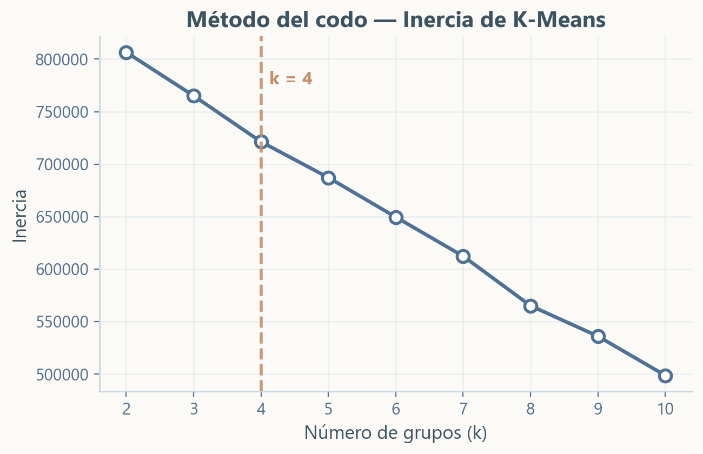
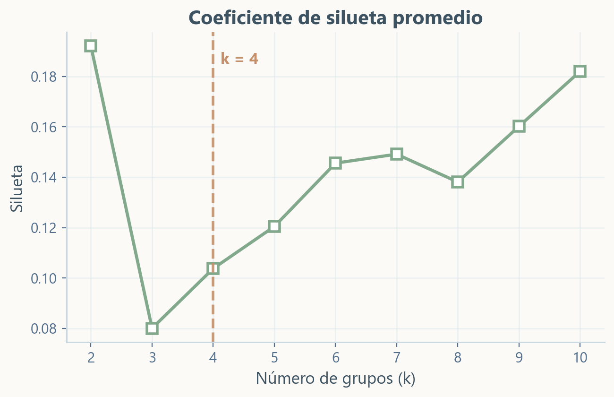
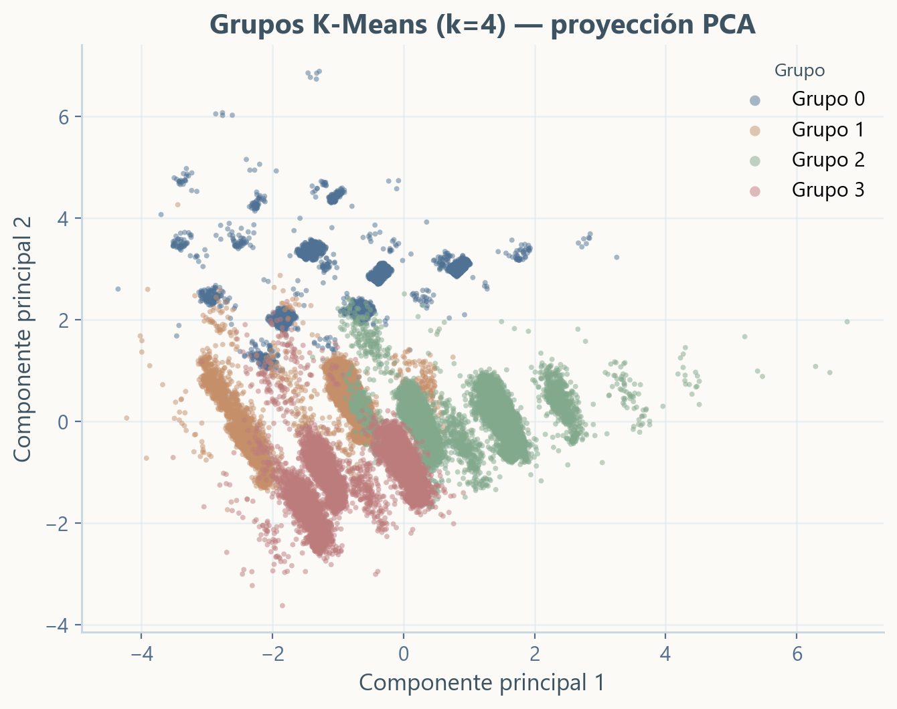
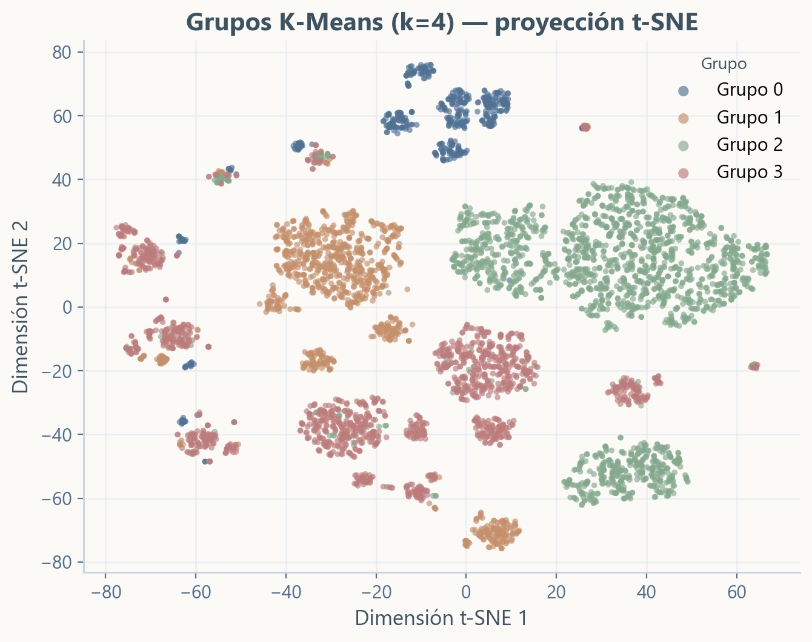
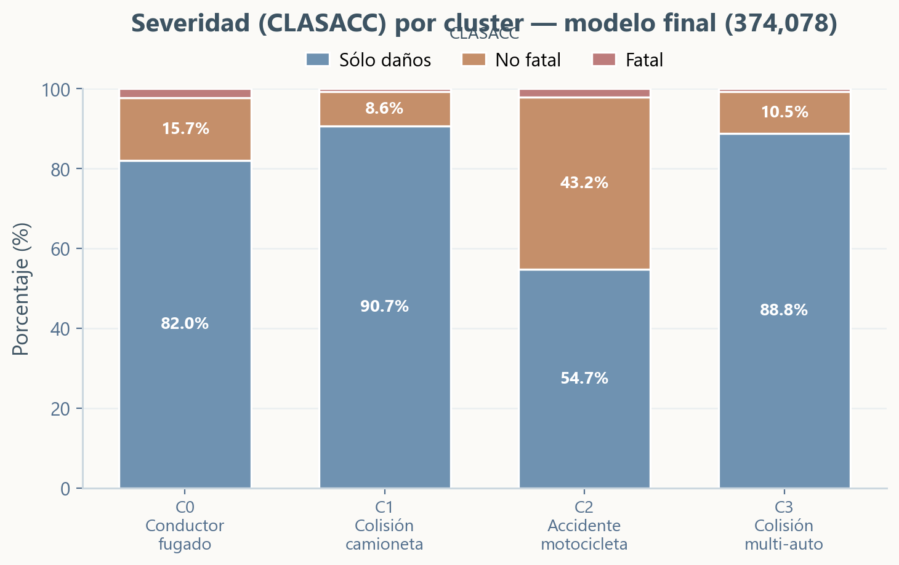
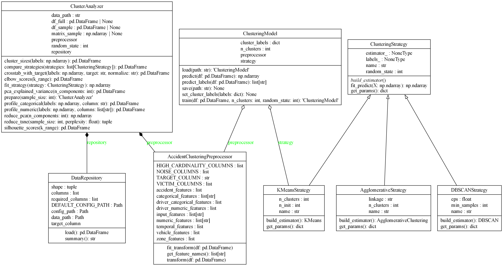

# Presentación del dataset {data-background-color="#213849"}

## ATUS 2024: accidentes en México

::: kicker
Dataset oficial · INEGI · transporte y movilidad
:::

::::: dataset-hero
::: hero-copy
El archivo **`atus_anual_2024.csv`** registra accidentes de tránsito terrestre ocurridos en zonas urbanas y suburbanas de México durante 2024.

La problemática se analiza desde su **severidad**: accidentes con sólo daños materiales, accidentes no fatales y accidentes fatales.
:::

::: hero-panel
**Fuente**

Accidentes de Tránsito Terrestre en Zonas Urbanas y Suburbanas\
Datos del INEGI · serie **1997-2024**
:::
:::::

:::::: metric-strip
::: metric
**390,627**\
registros originales
:::

::: metric
**45**\
variables documentadas
:::

::: metric
**32**\
entidades federativas
:::
::::::

------------------------------------------------------------------------

## Problema y objetivo

::: kicker
Seguridad vial · severidad del accidente
:::

::::: two-paths
::: path-card
**Problema**

Los accidentes de tránsito en zonas urbanas y suburbanas de México representan un problema de movilidad y seguridad pública por su frecuencia y por sus consecuencias humanas y materiales.
:::

::: path-card
**Objetivo**

Identificar qué condiciones del evento, lugar, momento, vehículos y conductor se relacionan con accidentes de mayor severidad.
:::
:::::

::: {.attention-note .attention-info}
El análisis busca distinguir perfiles de accidentes con **sólo daños**, **personas heridas** o **personas fallecidas**.
:::

------------------------------------------------------------------------

## Qué contiene cada registro

::::::: feature-grid
::: feature-card
**Lugar y momento**

Entidad, municipio, zona urbana o suburbana, mes, día, hora y minuto.
:::

::: feature-card
**Tipo de percance**

Tipo de accidente, causa presunta, superficie de rodamiento y ubicación vial.
:::

::: feature-card
**Vehículos**

Conteos por categoría: automóvil, motocicleta, camioneta, camión, bicicleta y otros.
:::

::: feature-card
**Personas afectadas**

Heridos y fallecidos: conductores, pasajeros, peatones, ciclistas y otras personas.
:::
:::::::

::: attention-note
`CLASACC` resume la severidad del accidente: **Sólo daños**, **No fatal** o **Fatal**.
:::

------------------------------------------------------------------------

## Por qué es útil para minería de datos

::::: two-paths
::: path-card
**Modelado supervisado**

`CLASACC` permite entrenar modelos para distinguir entre accidentes con sólo daños, no fatales y fatales.
:::

::: path-card
**Agrupamiento (Clustering)**

Al retirar la etiqueta de severidad, las variables descriptivas permiten formar perfiles de accidentes similares.
:::
:::::

::: {.attention-note .attention-info}
El dataset combina variables categóricas y numéricas: ubicación, temporalidad, tipo de accidente, vehículos, conductor y víctimas.
:::

# Análisis exploratorio {data-background-color="#213849"}

## Preparación para explorar

::: kicker
Limpieza mínima antes de graficar
:::

:::::: metric-strip
::: metric
**374,949**\
accidentes reales
:::

::: metric
**15,678**\
registros administrativos separados
:::

::: metric
**871**\
duplicados exactos detectados
:::
::::::

::::: two-paths
::: path-card
**Qué se conservó**

Los registros que sí representan accidentes y sus variables de lugar, tiempo, tipo de percance, vehículos, conductor y víctimas.
:::

::: {.attention-note .attention-warning}
**Qué se cuidó**

`Certificado cero` no se interpreta como accidente, y los códigos `0` y `99` de edad no se tratan como edades reales.
:::
:::::

------------------------------------------------------------------------

## Tipos de accidente

```{python}
import plotly.graph_objects as go

plot_page = "#fbfaf7"
ink = "#334155"
muted = "#475569"
grid = "#d7e0ea"
navy = "#31556f"
blue_light = "#bdd9eb"
blue_pale = "#e3f0f7"
blue_mid = "#4f7f9f"
blue_deep = "#24485f"
rose = "#d987a6"
rose_deep = "#a94f72"

base_layout = dict(
    autosize=True,
    paper_bgcolor=plot_page,
    plot_bgcolor=plot_page,
    font=dict(family="Aptos, Inter, Segoe UI, sans-serif", color=muted, size=15),
    hoverlabel=dict(bgcolor="#ffffff", bordercolor=grid, font=dict(color=ink)),
)

fig_tipos = go.Figure(go.Bar(
    orientation="h",
    y=[
        "Colisión con vehículo automotor",
        "Colisión con motocicleta",
        "Colisión con objeto fijo",
        "Volcadura",
        "Colisión con peatón",
        "Salida del camino",
        "Colisión con ciclista",
        "Otro",
    ][::-1],
    x=[224720, 61869, 43119, 13371, 11052, 10067, 4033, 2934][::-1],
    marker=dict(
        color=["#31556f", "#426b87", "#527f9d", "#6594b2", "#7aaac7", "#96bed7", "#b8d5e6", "#dcebf3"][::-1],
        line=dict(color="#ffffff", width=1.2),
    ),
    hovertemplate="%{y}<br><b>%{x:,}</b> accidentes<extra></extra>",
))
fig_tipos.update_layout(
    **base_layout,
    height=400,
    xaxis=dict(title="", gridcolor=grid, zeroline=False),
    yaxis=dict(title="", automargin=True),
    margin=dict(l=220, r=25, t=8, b=28),
)
fig_tipos.show()
```

:::::: {.metric-strip .plot-metrics}
::: metric
**59.93%**\
colisión con vehículo automotor
:::

::: metric
**16.50%**\
colisión con motocicleta
:::

::: metric
**11.50%**\
colisión con objeto fijo
:::
::::::

::: source-line
La colisión con vehículo automotor concentra **224,720 casos**, muy por encima de las demás categorías. La comparación permite ver qué tipos de accidente dominan el fenómeno y cuáles aparecen como eventos menos frecuentes, pero relevantes por su posible gravedad.
:::

------------------------------------------------------------------------

## Edad y sexo del conductor

```{python}
rangos_edad = ["10-14", "15-19", "20-24", "25-29", "30-34", "35-39", "40-44", "45-49",
               "50-54", "55-59", "60-64", "65-69", "70-74", "75-79", "80-84", "85-89",
               "90-94", "95-99"]
centros_edad = [12, 17, 22, 27, 32, 37, 42, 47, 52, 57, 62, 67, 72, 77, 82, 87, 92, 97]

fig_edades_sexo = go.Figure()
fig_edades_sexo.add_trace(go.Bar(
    name="Hombre",
    x=centros_edad,
    y=[907, 16185, 30122, 30719, 30301, 26499, 22426, 19123, 16393, 11877, 8779, 5776, 3705, 1993, 928, 291, 81, 142],
    width=5,
    opacity=0.76,
    marker=dict(color=blue_mid, line=dict(color=blue_mid, width=1)),
    customdata=rangos_edad,
    hovertemplate="Hombre · %{customdata} años<br><b>%{y:,}</b> registros<extra></extra>",
))
fig_edades_sexo.add_trace(go.Bar(
    name="Mujer",
    x=centros_edad,
    y=[147, 2635, 6273, 7460, 8027, 7155, 5731, 4492, 3587, 2291, 1778, 1204, 716, 366, 179, 37, 8, 15],
    width=5,
    opacity=0.74,
    marker=dict(color=rose, line=dict(color=rose, width=1)),
    customdata=rangos_edad,
    hovertemplate="Mujer · %{customdata} años<br><b>%{y:,}</b> registros<extra></extra>",
))
fig_edades_sexo.update_layout(
    **base_layout,
    height=400,
    barmode="overlay",
    bargap=0,
    xaxis=dict(title="", gridcolor=grid, dtick=10, range=[9, 100]),
    yaxis=dict(title="", gridcolor=grid, zeroline=False),
    shapes=[
        dict(type="line", x0=27, x1=27, y0=0, y1=1, yref="paper",
             line=dict(color=blue_mid, width=2.5, dash="dot")),
        dict(type="line", x0=32, x1=32, y0=0, y1=1, yref="paper",
             line=dict(color=rose, width=2.5, dash="dot")),
    ],
    annotations=[
        dict(x=27, y=1, yref="paper", text="Hombre: 25-29", showarrow=False,
             yanchor="bottom", font=dict(color=blue_deep, size=13)),
        dict(x=32, y=0.9, yref="paper", text="Mujer: 30-34", showarrow=False,
             yanchor="bottom", font=dict(color=rose_deep, size=13)),
    ],
    legend=dict(x=0.82, y=0.98, bgcolor="rgba(255,255,255,0.72)", bordercolor=grid, borderwidth=1),
    margin=dict(l=55, r=20, t=8, b=32),
)
fig_edades_sexo.show()
```

:::::: {.metric-strip .plot-metrics}
::: metric
**81.28%**\
hombres
:::

::: metric
**18.72%**\
mujeres
:::

::: metric
**49.69%**\
entre 25 y 44 años
:::
::::::

::: source-line
La gráfica usa únicamente edades válidas: **226,247** registros de hombres y **52,101** de mujeres. Se excluyen `0` y `99` porque representan conductor fugado y edad desconocida. La mayor concentración aparece entre **25 y 44 años**.
:::

------------------------------------------------------------------------

## Códigos especiales de edad

::::: two-paths
::: path-card
**Código `0`: conductor fugado**

No representa una edad. Indica que no se registró la edad porque el conductor se dio a la fuga.
:::

::: path-card
**Código `99`: edad desconocida**

Tampoco representa una edad. Se usa cuando la edad del conductor no fue especificada.
:::
:::::

:::::: {.metric-strip .plot-metrics}
::: metric
**9.34%**\
conductor fugado
:::

::: metric
**16.42%**\
edad desconocida
:::

::: metric
**25.76%**\
no son edades reales
:::
::::::

::: {.attention-note .attention-warning}
En `ID_EDAD`, el código **0** significa **conductor fugado** y el código **99** significa **edad desconocida**. Por eso se reemplazan por nulos antes de calcular estadísticas o entrenar modelos.
:::

------------------------------------------------------------------------

## Accidentes por hora

```{python}
fig_horas = go.Figure(go.Scatter(
    mode="lines+markers",
    x=list(range(24)),
    y=[9143, 7400, 6594, 5694, 4880, 4986, 8034, 15159, 20666, 19486, 18076, 17983,
       19678, 20678, 24225, 23663, 22532, 22348, 21872, 21473, 20055, 15801, 13636, 10887],
    line=dict(color=navy, width=4, shape="spline"),
    marker=dict(color="#ffffff", line=dict(color=navy, width=2), size=8),
    fill="tozeroy",
    fillcolor="rgba(111, 166, 201, 0.20)",
    hovertemplate="Hora %{x}:00<br><b>%{y:,}</b> accidentes<extra></extra>",
))
fig_horas.update_layout(
    **base_layout,
    height=400,
    xaxis=dict(title="", dtick=1, gridcolor=grid, zeroline=False),
    yaxis=dict(title="", gridcolor=grid, zeroline=False),
    margin=dict(l=55, r=20, t=8, b=30),
)
fig_horas.show()
```

:::::: {.metric-strip .plot-metrics}
::: metric
**6.46%**\
ocurre a las 14:00
:::

::: metric
**30.57%**\
ocurre entre 14:00 y 18:00
:::

::: metric
**52.41%**\
ocurre entre 12:00 y 20:00
:::
::::::

::: source-line
Esta fue una de las variables temporales más interesantes del EDA: los registros aumentan desde la mañana y alcanzan su punto más alto alrededor de las **14:00 horas**.
:::

# Análisis Descriptivo y Estadístico {data-background-color="#213849"}

## Extraer información de nuestros datos

Hacemos un análisis a nuestro dataset para:

- Encontrar fenómenos y darles una explicación.

- Establecer reglas de comportamiento.

- Dar conclusiones respaldadas.

- Extraer **conocimiento** de nuestros datos.

## ¿Cómo hacemos esto?

Ya tenemos una fuente de datos:

¿Cómo podemos extraer este **conocimiento**?

¿Dónde y cómo empezamos un análisis?

Existen muchas estrategias, pero en este caso iremos de lo **general** a lo **particular.**

Analizar el panorama completo nos da perspectiva de los datos.

## Lo general: Localización.

¿Cuáles son los datos que predominan?

**Género de los conductores**


## Localización: Entidades con más accidentes.


## Peculiaridad en los datos.

Aplicando lo anterior a las edades, parece que hay una tendencia.


## Algo parecido con las horas.


## ¿Existen tendencias? Variabilidad.

Gracias a distintas herramientas, como la varianza y la desviación estándar, podemos apreciar lo siguiente.


## Lo mismo ocurre con las edades.


## ¿Qué podemos concluir?

**"La mayor concentración de siniestros viales involucra a conductores en un rango de edad productiva de entre los 22 y los 52 años.”**

**\
“La mayor densidad de los accidentes de tránsito terrestre se manifiesta de manera sostenida en el intervalo diurno comprendido entre las 07:00 y las 19:00 horas.”**\

## ¿Qué más podemos decir de los datos?

Nos hacemos más preguntas.

¿Existirán más tendencias en nuestros datos?

¿Habrá otro atributo que concentre accidentes?

¿Es un problema que afecta a todos los estados o solo unos pocos?

¿El tiempo juega un factor?

## Heterogeneidad: No existen tendencias claras.

El problema es generalizado a pesar de la concentración de casos.

Norte/Sur, Ciudad/Campo, Importancia: Los conjuntos se contradicen con sus resultados.


# Correlación {data-background-color="#213849"}

## Análisis de fenómenos.

Ya analizamos características del evento, pero ¿Qué hay de sus repercusiones?

Contamos con las siguientes columnas:

**'CONDMUERTO', 'CONDHERIDO', 'PASAMUERTO', 'PASAHERIDO', 'PEATMUERTO', 'PEATHERIDO', 'CICLMUERTO', 'CICLHERIDO', 'OTROMUERTO', 'OTROHERIDO'**. Describen el número de conductores, pasajeros, peatones, ciclistas u otras personas que salieron heridas/fallecidas después del incidente.

**'CLASACC'** es una bandera que indica si hubo saldo blanco o no de los accidentes

**'CONDUCTOR_FUGADO'** indica si un conductor se dió a la fuga o no.

## ¿Existirá una relación entre las circunstancias del accidente con estas variables?

Más que lo evidente, aparentemente no hay muchas relaciones.

Un conductor herido/fallecido implica pasajeros heridos/fallecidos


## Un fenómeno no tan evidente

No tan evidente en el heatmap directamente, pero nos indica algo interesante:

"Si el accidente presenta personas fallecidas, la probabilidad de que el perpetrador se de a la fuga es casi el doble que en casos no fatales"


## Agravantes y mitigantes de riesgo ¿Son realmente relevantes?

Contamos con las variables ALIENTO y CINTURON.

ALIENTO: La persona presentaba un aliento que revelaba un estado de ebriedad o no.

CINTURON: La persona conductora llevaba el cinturon de seguridad puesto o no.

¿Estos factores agravaron o mitigaron el riesgo en los accidentes?

También contamos con el número de vehículos involucrados en el accidente y sus tipos:

**'AUTOMOVIL', 'CAMPASAJ', 'MICROBUS', 'PASCAMION', 'OMNIBUS', 'TRANVIA', 'CAMIONETA', 'CAMION', 'TRACTOR', 'FERROCARRI', 'MOTOCICLET', 'BICICLETA', 'OTROVEHIC'**

¿Alguno de estos vehículos presenta más riesgos?

## Agravantes y mitigantes de riesgo. Repercusiones.


# Agrupamiento (Clustering) {data-background-color="#213849"}

## ¿Existen perfiles de accidente?

::: kicker
Agrupamiento no supervisado · K-Means · 374,078 registros
:::

::::: two-paths
::: path-card
**La pregunta** Hasta ahora describimos la severidad. Ahora preguntamos distinto:

**¿Hay tipos naturales de accidente que agrupen registros con condiciones similares, sin usar la etiqueta de gravedad?**
:::

::: path-card
**La decisión clave**

Excluimos `CLASACC` y de la entrada las **10 columnas de víctimas.** Si las incluyéramos, los grupos reconstruirían la severidad que ya conocemos.

Al retirarlas, los perfiles emergen solo del contexto del accidente: **vehículos, hora, zona, conductor.**
:::
:::::

::: attention-note
La validez del método depende de esta exclusión. Si `CLASACC` aparece ordenada después, no fue porque el modelo la vio, fue porque los perfiles capturan física real.
:::

## ¿Cómo preparamos los datos?

::: {style="display:grid; grid-template-columns:1fr 1fr; gap:1em; margin-top:0.5em"}
::: {style="border:2px solid var(--line); border-left:0.42em solid var(--blue); border-radius:var(--radius); padding:1.1em 1.2em; font-size:0.76em; line-height:1.45"}
**Variables incluidas — contexto del accidente**

**Temporales (3):** `MES` · `ID_HORA` · `DIASEMANA`

**Zona (2):** `URBANA` · `SUBURBANA`

**Tipo y causa (3):** `TIPACCID` · `CAUSAACCI` · `CAPAROD`

**Vehículos (13):** `AUTOMOVIL` · `CAMPASAJ` · `MICROBUS` · `PASCAMION` · `OMNIBUS` · `TRANVIA` · `CAMIONETA` · `CAMION` · `TRACTOR` · `FERROCARRI` · `MOTOCICLET` · `BICICLETA` · `OTROVEHIC`

**Conductor (6):** `SEXO` · `ALIENTO` · `CINTURON` · `ID_EDAD` · `CONDUCTOR_FUGADO` · `EDAD_DESCONOCIDA`

→ **27 variables** · 18 numéricas + 9 categóricas → **60 columnas** tras one-hot
:::
::: {style="border:2px solid var(--line); border-left:0.42em solid var(--red); border-radius:var(--radius); padding:1.1em 1.2em; font-size:0.76em; line-height:1.45"}
**Variables excluidas — desenlace**

**Objetivo supervisado (1):** `CLASACC`

**Víctimas (10):** `CONDMUERTO` · `CONDHERIDO` · `PASAMUERTO` · `PASAHERIDO` · `PEATMUERTO` · `PEATHERIDO` · `CICLMUERTO` · `CICLHERIDO` · `OTROMUERTO` · `OTROHERIDO`

→ Revelan directamente la gravedad: incluirlas haría que los grupos recuperaran la severidad en lugar de descubrir perfiles nuevos.

**Alta cardinalidad (2):** `NOM_ENT` (32 categorías) · `NOM_MUN` (1,435 categorías)

**Granularidad fina (2):** `ID_MINUTO` · `ID_DIA`

→ Sin valor de perfil y generarían ruido dimensional.
:::
:::

## Preprocesamiento y estrategia de cómputo

::: {style="display:grid; grid-template-columns:1fr 1fr; gap:1em; margin-top:0.4em"}
::: {style="border:2px solid var(--line); border-left:0.42em solid var(--green); border-radius:var(--radius); padding:1.1em 1.2em; font-size:0.79em; line-height:1.42"}
**Preprocesamiento con `ColumnTransformer`**

Las **18 variables numéricas** pasan por imputación por mediana y luego por `StandardScaler`. La estandarización es **obligatoria para K-Means**: el algoritmo calcula distancias euclidianas, por lo que una variable en miles (ej. conteo de vehículos) dominaría sobre una en unidades (ej. hora) si no se normalizan.

Las **9 variables categóricas** pasan por imputación por moda y `OneHotEncoder` con `handle_unknown="ignore"`, lo que permite usar el modelo en datos nuevos sin fallar si aparece una categoría no vista durante el entrenamiento.

El resultado es una **matriz de 60 columnas** donde todas las variables tienen la misma escala y están listas para el cálculo de distancias.
:::
::: {style="border:2px solid var(--line); border-left:0.42em solid var(--yellow); border-radius:var(--radius); padding:1.1em 1.2em; font-size:0.79em; line-height:1.42"}

**Fase exploratoria — muestra de 40,000 registros** con `random_state=42`: se usa para el método del codo, el coeficiente de silueta, la comparación de algoritmos, PCA y t-SNE. Calcular silueta o t-SNE sobre 374k registros es inviable en tiempo y memoria; 40k ya produce estimaciones estables dado el tamaño original.

**Fase final — 374,078 registros completos**: una vez elegido el algoritmo y los parámetros, K-Means se re-entrena sobre todo el dataset. Los tamaños de cluster, los porcentajes de severidad y los perfiles descriptivos que reportamos provienen exclusivamente de esta fase.

Los IDs numéricos de cluster pueden diferir entre fases; la correspondencia se establece por el perfil semántico de cada grupo, no por el número asignado.
:::
:::

## ¿Cuántos grupos? Codo y silueta. {.center}

::: {style="display:grid; grid-template-columns:1fr 1fr; gap:1.2em; align-items:center; margin-top:0.3em"}
{style="width:100%; border-radius:14px"}

{style="width:100%; border-radius:14px"}
:::

::: attention-note
La inercia cae gradual (sin codo nítido) y la silueta es máxima en k=2 (partición trivial: motos vs. todo). Priorizamos **interpretabilidad**: **k = 4** produce perfiles distintos y accionables.
:::

## Comparamos tres algoritmos

::: {style="margin-top:0.4em"}
| Algoritmo | Grupos | Ruido | Silueta | Decisión |
|---|---:|---:|---:|:---|
| **K-Means (k=4)** | **4** | **0** | **0.104** | **Elegido — escala a 374k**, **tiene** `predict` |
| Aglomerativo (Ward) | 4 | 0 | 0.228 | O(n²): requeriría ~140 mil millones de entradas |
| DBSCAN (ε=2.0) | 44 | 7,636 | 0.186 | Fragmenta en 44 microgrupos; 19% descartado como ruido |
:::

::: attention-note
El aglomerativo tiene mejor silueta pero **no escala**. DBSCAN confirma que no hay densidad bien definida en estos datos y la nube es continua. K-Means gana por **escalabilidad, interpretabilidad y `predict`**.
:::

## Proyección PCA y t-SNE {.center}

::: {style="display:grid; grid-template-columns:1fr 1fr; gap:1em; align-items:center"}
{style="width:100%; border-radius:14px"}

{style="width:100%; border-radius:14px"}
:::

::: {.source-line style="font-size:0.62em; margin-top:0.3em; text-align:center"}
Ambas son proyecciones cualitativas: comprimen 60 dimensiones a 2. Las fronteras son graduales.
:::

## Los 4 perfiles encontrados

::: {.source-line style="font-size:0.72em; margin-bottom:0.5em; line-height:1.4"}
Cada perfil recibió su nombre después del agrupamiento, al observar qué variable domina su comportamiento.
:::

::: {style="display:grid; grid-template-columns:1fr 1fr; gap:0.8em"}
::: {style="border:2px solid var(--line); border-left:0.42em solid var(--blue); border-radius:var(--radius); padding:0.9em 1em; font-size:0.74em; line-height:1.42"}
**C0 — Conductor fugado, accidente mixto** · 9.3%

`CONDUCTOR_FUGADO ≈ 1.0` prácticamente el 100% de los registros son fugas. Por eso sexo, alcohol y cinturón aparecen como "desconocido" o "se ignora": nadie quedó en escena para ser registrado. Ocurre más los **domingos (21.2%)** que cualquier otro día. El **2.2% de sus accidentes son fatales** el triple del 0.7% que presentan los grupos de camioneta y multi-automóvil.
:::
::: {style="border:2px solid var(--line); border-left:0.42em solid var(--orange); border-radius:var(--radius); padding:0.9em 1em; font-size:0.74em; line-height:1.42"}
**C1 — Colisión con camioneta** · 31.2%

En promedio, cada accidente de este grupo involucra **0.35 camionetas de carga** el valor más alto de los cuatro grupos. El conductor tiene la mayor edad media (39.6 años) y la menor presencia de alcohol (76% sin aliento). Perfil compatible con conductor de reparto o carga en horario diurno. **90.7% termina en solo daños** es el más benigno de los cuatro.
:::
::: {style="border:2px solid var(--line); border-left:0.42em solid var(--green); border-radius:var(--radius); padding:0.9em 1em; font-size:0.74em; line-height:1.42"}
**C2 — Accidente con motocicleta** · 20.3%

`MOTOCICLET = 1.03` toda colisión del grupo involucra una moto. El conductor más joven (34.4 años), mayormente masculinos (86%), y accidenta en el horario más tardío (14.1 h). Sin carrocería protectora entre el cuerpo y el impacto. Resultado: **43.2% de heridos** cinco veces más que camioneta.
:::
::: {style="border:2px solid var(--line); border-left:0.42em solid var(--red); border-radius:var(--radius); padding:0.9em 1em; font-size:0.74em; line-height:1.42"}
**C3 — Colisión multi-automóvil** · 39.1%

`AUTOMOVIL = 1.83` promedio casi dos autos por accidente. Es el grupo más numeroso y el menos diferenciado: sin pico claro de hora ni día, sin señal de alcohol o fuga. Representa el choque urbano cotidiano. La carrocería de ambos vehículos absorbe el impacto: **88.8% solo daños**.
:::
:::


## La validación más importante {.center}

{.r-stretch style="border-radius:14px; margin:0 auto; display:block"}

::: {.attention-note .attention-success style="margin-top:0.5em"}
Los grupos se ordenan por severidad de manera natural. El **Cluster 2 (motos)** concentra **43.2% de heridos**. Los perfiles capturaron **física real**: cuerpo expuesto en moto vs. blindaje del automóvil.
:::

## Arquitectura del módulo `src/clustering/`

::: {style="display:grid; grid-template-columns:1.2fr 0.8fr; gap:1.2em; align-items:center; margin-top:0.3em"}
{style="width:100%; border-radius:14px"}

::: {style="display:flex; flex-direction:column; gap:0.7em; font-size:0.8em"}
::: {style="border:2px solid var(--line); border-left:0.42em solid var(--blue); border-radius:var(--radius); padding:0.75em 0.9em; line-height:1.3"}
**Repository** · `DataRepository`\
Abstrae el acceso al CSV detrás de una interfaz uniforme.
:::
::: {style="border:2px solid var(--line); border-left:0.42em solid var(--orange); border-radius:var(--radius); padding:0.75em 0.9em; line-height:1.3"}
**Strategy** · `ClusteringStrategy`\
Intercambia K-Means, Ward y DBSCAN sin cambiar el cliente.
:::
::: {style="border:2px solid var(--line); border-left:0.42em solid var(--green); border-radius:var(--radius); padding:0.75em 0.9em; line-height:1.3"}
**Composición** · `ClusterAnalyzer`, `ClusteringModel`\
Modelo serializable en `clustering_kmeans.joblib` predice sin re-entrenar.
:::
:::
:::

## En conclusión: ¿a qué llegamos?

::: kicker
Frecuencia y gravedad apuntan a lugares distintos
:::

Los accidentes **no son homogéneos** — el algoritmo descubrió cuatro perfiles sin ver la severidad.

:::::: metric-strip
::: metric
**70.3%**\
son leves (auto + camioneta)
:::
::: metric
**5×**\
más heridos en moto que en camioneta
:::
::: metric
**2.2%**\
mortalidad en fugados — el triple que autos
:::
::::::

::: {style="display:grid; grid-template-columns:1fr 1fr; gap:0.75em; margin-top:0.7em; font-size:0.74em"}
::: {style="border:2px solid var(--line); border-left:0.42em solid var(--blue); border-radius:var(--radius); padding:0.75em 0.9em; line-height:1.35"}
**El vehículo define el accidente**\
Hora, zona y causa son casi iguales en los 4 grupos. Lo que los separa es el vehículo. Antes era una hipótesis — ahora es un hecho demostrado matemáticamente.
:::
::: {style="border:2px solid var(--line); border-left:0.42em solid var(--orange); border-radius:var(--radius); padding:0.75em 0.9em; line-height:1.35"}
**La validación es la prueba más fuerte**\
`CLASACC` nunca entró al modelo y aun así ordena los grupos limpiamente. Si los perfiles fueran ruido, la severidad se distribuiría igual en los cuatro. No lo hace.
:::
:::

## Implicación de política vial

::: kicker
La frecuencia no es el problema — el daño humano sí
:::

::: {style="display:grid; grid-template-columns:1fr 1fr; gap:0.85em; margin-top:0.5em"}
::: {style="border:2px solid var(--line); border-left:0.42em solid var(--green); border-radius:var(--radius); padding:1em 1.1em; font-size:0.8em; line-height:1.4"}
**Prioridad 1 — Proteger al motociclista**\
Conductor joven (34 años), varón (86%), horario vespertino (14 h), sin carrocería protectora.\
43.2% de heridos contra 8.6% en camioneta.\
El modelo lo descubrió **sin ver datos de víctimas**: es física, no correlación casual.
:::
::: {style="border:2px solid var(--line); border-left:0.42em solid var(--red); border-radius:var(--radius); padding:1em 1.1em; font-size:0.8em; line-height:1.4"}
**Prioridad 2 — Disuadir la fuga**\
Pico en domingo, conductor desconocido, mayor mortalidad (2.2% — el triple).\
Sin responsable identificado por definición.\
El perfil con mayor costo humano y **menor rendición de cuentas**.
:::
:::

::: attention-note
Perseguir el accidente más **frecuente** (choque entre autos) para mejorar seguridad vial es ineficiente. Los datos señalan dónde está el problema real: **motociclistas** y **conductores que huyen**. El modelo queda guardado y puede clasificar cualquier accidente nuevo sin re-entrenar.
:::

