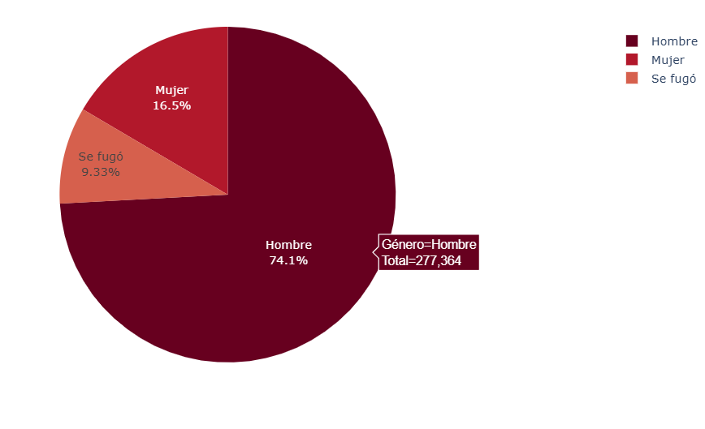
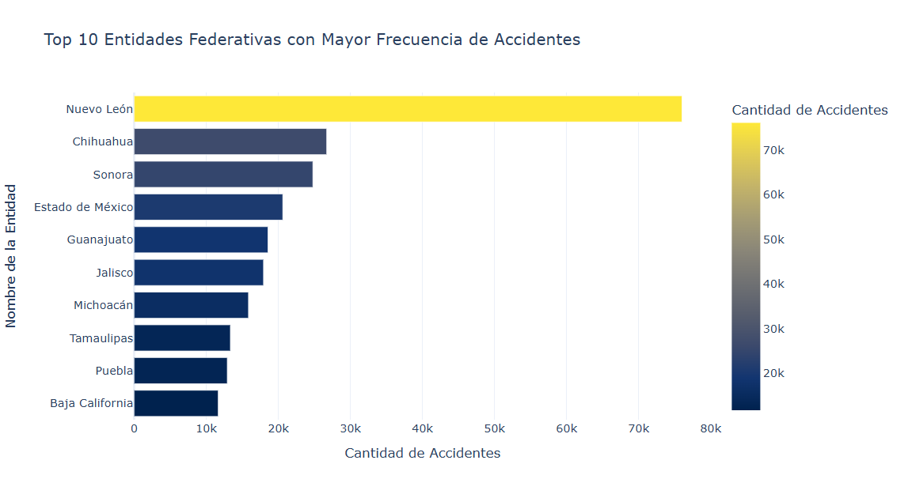
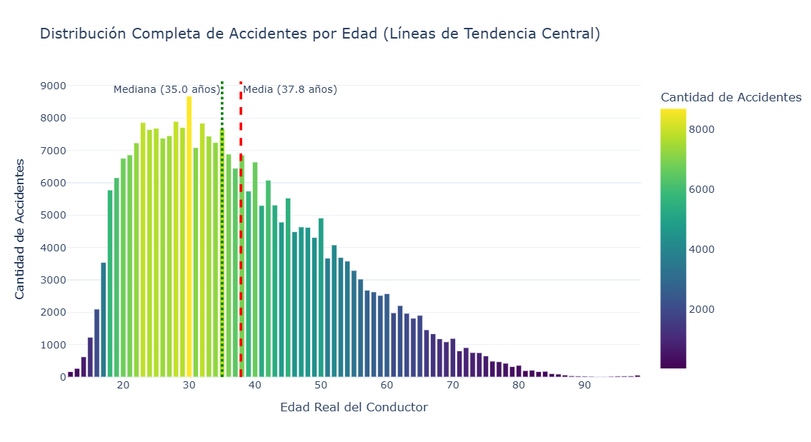
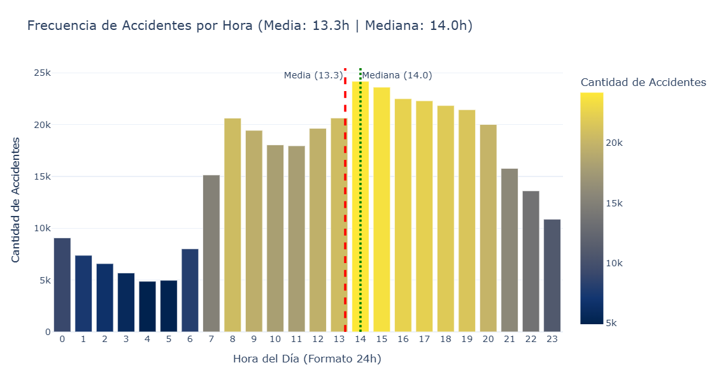
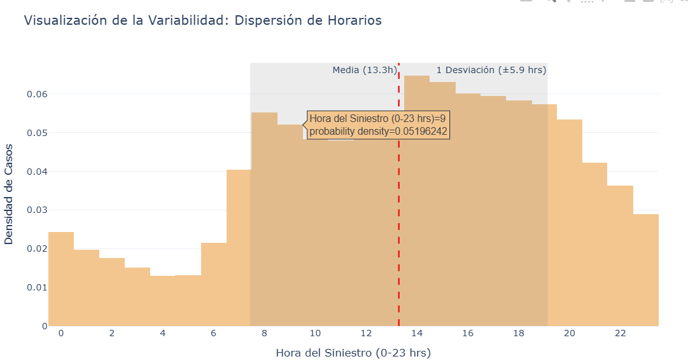
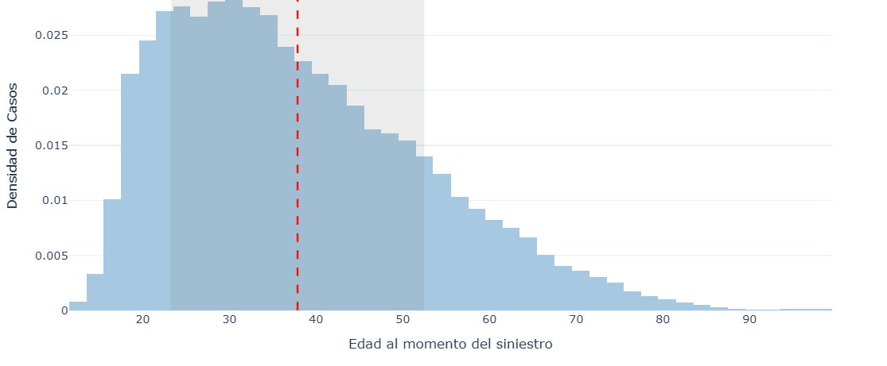
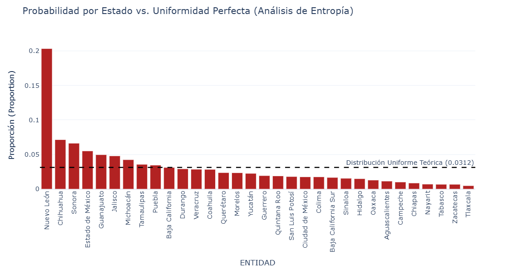
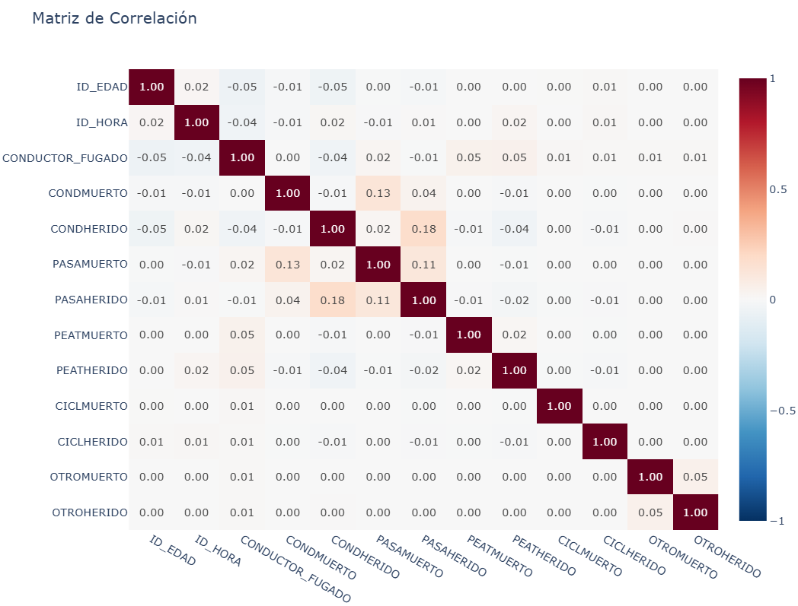
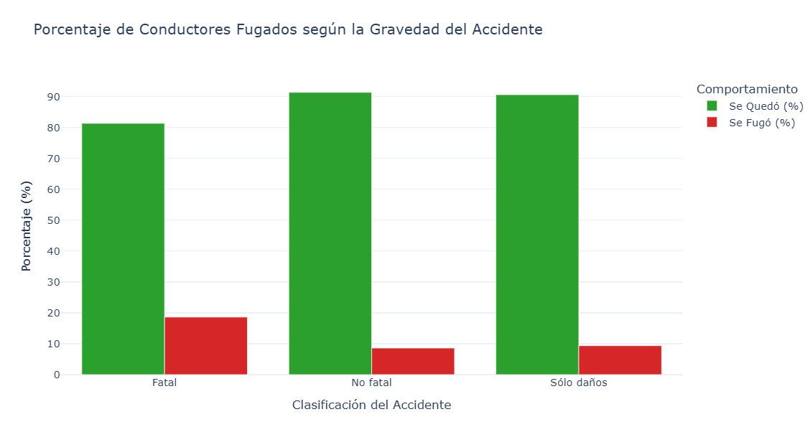
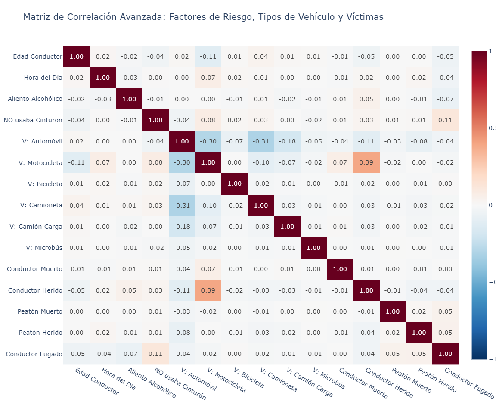

# Presentación del dataset {data-background-color="#213849"}

## ATUS 2024: accidentes en México

::: kicker
Dataset oficial · INEGI · transporte y movilidad
:::

::::: dataset-hero
::: hero-copy
El archivo **`atus_anual_2024.csv`** registra accidentes de tránsito terrestre ocurridos en zonas urbanas y suburbanas de México durante 2024.

La problemática se analiza desde su **severidad**: accidentes con sólo daños materiales, accidentes no fatales y accidentes fatales.
:::

::: hero-panel
**Fuente**

Accidentes de Tránsito Terrestre en Zonas Urbanas y Suburbanas\
Datos del INEGI · serie **1997-2024**
:::
:::::

:::::: metric-strip
::: metric
**390,627**\
registros originales
:::

::: metric
**45**\
variables documentadas
:::

::: metric
**32**\
entidades federativas
:::
::::::

------------------------------------------------------------------------

## Problema y objetivo

::: kicker
Seguridad vial · severidad del accidente
:::

::::: two-paths
::: path-card
**Problema**

Los accidentes de tránsito en zonas urbanas y suburbanas de México representan un problema de movilidad y seguridad pública por su frecuencia y por sus consecuencias humanas y materiales.
:::

::: path-card
**Objetivo**

Identificar qué condiciones del evento, lugar, momento, vehículos y conductor se relacionan con accidentes de mayor severidad.
:::
:::::

::: {.attention-note .attention-info}
El análisis busca distinguir perfiles de accidentes con **sólo daños**, **personas heridas** o **personas fallecidas**.
:::

------------------------------------------------------------------------

## Qué contiene cada registro

::::::: feature-grid
::: feature-card
**Lugar y momento**

Entidad, municipio, zona urbana o suburbana, mes, día, hora y minuto.
:::

::: feature-card
**Tipo de percance**

Tipo de accidente, causa presunta, superficie de rodamiento y ubicación vial.
:::

::: feature-card
**Vehículos**

Conteos por categoría: automóvil, motocicleta, camioneta, camión, bicicleta y otros.
:::

::: feature-card
**Personas afectadas**

Heridos y fallecidos: conductores, pasajeros, peatones, ciclistas y otras personas.
:::
:::::::

::: attention-note
`CLASACC` resume la severidad del accidente: **Sólo daños**, **No fatal** o **Fatal**.
:::

------------------------------------------------------------------------

## Por qué es útil para minería de datos

::::: two-paths
::: path-card
**Modelado supervisado**

`CLASACC` permite entrenar modelos para distinguir entre accidentes con sólo daños, no fatales y fatales.
:::

::: path-card
**Agrupamiento**

Al retirar la etiqueta de severidad, las variables descriptivas permiten formar perfiles de accidentes similares.
:::
:::::

::: {.attention-note .attention-info}
El dataset combina variables categóricas y numéricas: ubicación, temporalidad, tipo de accidente, vehículos, conductor y víctimas.
:::

# Análisis exploratorio {data-background-color="#213849"}

## Preparación para explorar

::: kicker
Limpieza mínima antes de graficar
:::

:::::: metric-strip
::: metric
**374,949**\
accidentes reales
:::

::: metric
**15,678**\
registros administrativos separados
:::

::: metric
**871**\
duplicados exactos detectados
:::
::::::

::::: two-paths
::: path-card
**Qué se conservó**

Los registros que sí representan accidentes y sus variables de lugar, tiempo, tipo de percance, vehículos, conductor y víctimas.
:::

::: {.attention-note .attention-warning}
**Qué se cuidó**

`Certificado cero` no se interpreta como accidente, y los códigos `0` y `99` de edad no se tratan como edades reales.
:::
:::::

------------------------------------------------------------------------

## Tipos de accidente

::: {#plot-tipos .plotly-chart}
:::

:::::: {.metric-strip .plot-metrics}
::: metric
**59.93%**\
colisión con vehículo automotor
:::

::: metric
**16.50%**\
colisión con motocicleta
:::

::: metric
**11.50%**\
colisión con objeto fijo
:::
::::::

::: source-line
La colisión con vehículo automotor concentra **224,720 casos**, muy por encima de las demás categorías. La comparación permite ver qué tipos de accidente dominan el fenómeno y cuáles aparecen como eventos menos frecuentes, pero relevantes por su posible gravedad.
:::

------------------------------------------------------------------------

## Edad y sexo del conductor

::: {#plot-edades-sexo .plotly-chart}
:::

:::::: {.metric-strip .plot-metrics}
::: metric
**81.28%**\
hombres
:::

::: metric
**18.72%**\
mujeres
:::

::: metric
**49.69%**\
entre 25 y 44 años
:::
::::::

::: source-line
La gráfica usa únicamente edades válidas: **226,247** registros de hombres y **52,101** de mujeres. Se excluyen `0` y `99` porque representan conductor fugado y edad desconocida. La mayor concentración aparece entre **25 y 44 años**.
:::

------------------------------------------------------------------------

## Códigos especiales de edad

::::: two-paths
::: path-card
**Código `0`: conductor fugado**

No representa una edad. Indica que no se registró la edad porque el conductor se dio a la fuga.
:::

::: path-card
**Código `99`: edad desconocida**

Tampoco representa una edad. Se usa cuando la edad del conductor no fue especificada.
:::
:::::

:::::: {.metric-strip .plot-metrics}
::: metric
**9.34%**\
conductor fugado
:::

::: metric
**16.42%**\
edad desconocida
:::

::: metric
**25.76%**\
no son edades reales
:::
::::::

::: {.attention-note .attention-warning}
En `ID_EDAD`, el código **0** significa **conductor fugado** y el código **99** significa **edad desconocida**. Por eso se reemplazan por nulos antes de calcular estadísticas o entrenar modelos.
:::

------------------------------------------------------------------------

## Accidentes por hora

::: {#plot-horas .plotly-chart}
:::

:::::: {.metric-strip .plot-metrics}
::: metric
**6.46%**\
ocurre a las 14:00
:::

::: metric
**30.57%**\
ocurre entre 14:00 y 18:00
:::

::: metric
**52.41%**\
ocurre entre 12:00 y 20:00
:::
::::::

::: source-line
Esta fue una de las variables temporales más interesantes del EDA: los registros aumentan desde la mañana y alcanzan su punto más alto alrededor de las **14:00 horas**.
:::

```{=html}
<script src="https://cdn.plot.ly/plotly-2.35.2.min.js"></script>
<script>
document.addEventListener("DOMContentLoaded", function () {
  const plotPage = "#fbfaf7";
  const ink = "#334155";
  const muted = "#475569";
  const grid = "#d7e0ea";
  const navy = "#31556f";
  const blue = "#6fa6c9";
  const blueLight = "#bdd9eb";
  const bluePale = "#e3f0f7";
  const blueMid = "#4f7f9f";
  const blueSoft = "#8fb9d2";
  const blueDeep = "#24485f";
  const rose = "#d987a6";
  const roseDeep = "#a94f72";

  const config = {
    responsive: true,
    displayModeBar: false,
    displaylogo: false,
    modeBarButtonsToRemove: ["lasso2d", "select2d"]
  };

  const baseLayout = {
    autosize: true,
    paper_bgcolor: plotPage,
    plot_bgcolor: plotPage,
    font: {
      family: "Aptos, Inter, Segoe UI, sans-serif",
      color: muted,
      size: 15
    },
    margin: { l: 70, r: 30, t: 20, b: 55 },
    hoverlabel: {
      bgcolor: "#ffffff",
      bordercolor: grid,
      font: { color: ink }
    }
  };

  Plotly.newPlot("plot-tipos", [{
    type: "bar",
    orientation: "h",
    y: [
      "Colisión con vehículo automotor",
      "Colisión con motocicleta",
      "Colisión con objeto fijo",
      "Volcadura",
      "Colisión con peatón",
      "Salida del camino",
      "Colisión con ciclista",
      "Otro"
    ].reverse(),
    x: [224720, 61869, 43119, 13371, 11052, 10067, 4033, 2934].reverse(),
    marker: {
      color: ["#31556f", "#426b87", "#527f9d", "#6594b2", "#7aaac7", "#96bed7", "#b8d5e6", "#dcebf3"].reverse(),
      line: { color: "#ffffff", width: 1.2 }
    },
    hovertemplate: "%{y}<br><b>%{x:,}</b> accidentes<extra></extra>"
  }], {
    ...baseLayout,
    xaxis: { title: "", gridcolor: grid, zeroline: false },
    yaxis: { title: "", automargin: true },
    margin: { l: 230, r: 35, t: 15, b: 55 }
  }, config);

  Plotly.newPlot("plot-edades-sexo", [{
    type: "bar",
    name: "Hombre",
    x: [12, 17, 22, 27, 32, 37, 42, 47, 52, 57, 62, 67, 72, 77, 82, 87, 92, 97],
    y: [907, 16185, 30122, 30719, 30301, 26499, 22426, 19123, 16393, 11877, 8779, 5776, 3705, 1993, 928, 291, 81, 142],
    width: 5,
    opacity: 0.76,
    marker: { color: blueMid, line: { color: blueMid, width: 1 } },
    customdata: ["10-14", "15-19", "20-24", "25-29", "30-34", "35-39", "40-44", "45-49", "50-54", "55-59", "60-64", "65-69", "70-74", "75-79", "80-84", "85-89", "90-94", "95-99"],
    hovertemplate: "Hombre · %{customdata} años<br><b>%{y:,}</b> registros<extra></extra>"
  }, {
    type: "bar",
    name: "Mujer",
    x: [12, 17, 22, 27, 32, 37, 42, 47, 52, 57, 62, 67, 72, 77, 82, 87, 92, 97],
    y: [147, 2635, 6273, 7460, 8027, 7155, 5731, 4492, 3587, 2291, 1778, 1204, 716, 366, 179, 37, 8, 15],
    width: 5,
    opacity: 0.74,
    marker: { color: rose, line: { color: rose, width: 1 } },
    customdata: ["10-14", "15-19", "20-24", "25-29", "30-34", "35-39", "40-44", "45-49", "50-54", "55-59", "60-64", "65-69", "70-74", "75-79", "80-84", "85-89", "90-94", "95-99"],
    hovertemplate: "Mujer · %{customdata} años<br><b>%{y:,}</b> registros<extra></extra>"
  }], {
    ...baseLayout,
    barmode: "overlay",
    bargap: 0,
    xaxis: { title: "", gridcolor: grid, dtick: 10, range: [9, 100] },
    yaxis: { title: "", gridcolor: grid, zeroline: false },
    shapes: [{
      type: "line",
      x0: 27,
      x1: 27,
      y0: 0,
      y1: 1,
      yref: "paper",
      line: { color: blueMid, width: 2.5, dash: "dot" }
    }, {
      type: "line",
      x0: 32,
      x1: 32,
      y0: 0,
      y1: 1,
      yref: "paper",
      line: { color: rose, width: 2.5, dash: "dot" }
    }],
    annotations: [{
      x: 27,
      y: 1,
      yref: "paper",
      text: "Hombre: 25-29",
      showarrow: false,
      yanchor: "bottom",
      font: { color: blueDeep, size: 13 }
    }, {
      x: 32,
      y: 0.9,
      yref: "paper",
      text: "Mujer: 30-34",
      showarrow: false,
      yanchor: "bottom",
      font: { color: roseDeep, size: 13 }
    }],
    legend: { x: 0.82, y: 0.98, bgcolor: "rgba(255,255,255,0.72)", bordercolor: grid, borderwidth: 1 },
    margin: { l: 70, r: 25, t: 15, b: 65 }
  }, config);

  Plotly.newPlot("plot-severidad", [{
    type: "pie",
    labels: ["Sólo daños", "No fatal", "Fatal"],
    values: [306841, 63920, 4188],
    hole: 0.58,
    sort: false,
    marker: {
      colors: [bluePale, blueLight, navy],
      line: { color: "#ffffff", width: 3 }
    },
    textinfo: "label+percent",
    hovertemplate: "%{label}<br><b>%{value:,}</b> accidentes<extra></extra>"
  }], {
    ...baseLayout,
    annotations: [{
      text: "<b>374,949</b><br>accidentes",
      showarrow: false,
      font: { color: ink, size: 22 }
    }],
    margin: { l: 25, r: 25, t: 5, b: 20 },
    showlegend: true,
    legend: { orientation: "h", x: 0.5, xanchor: "center", y: -0.08 }
  }, config);

  Plotly.newPlot("plot-horas", [{
    type: "scatter",
    mode: "lines+markers",
    x: Array.from({ length: 24 }, (_, i) => i),
    y: [9143, 7400, 6594, 5694, 4880, 4986, 8034, 15159, 20666, 19486, 18076, 17983, 19678, 20678, 24225, 23663, 22532, 22348, 21872, 21473, 20055, 15801, 13636, 10887],
    line: { color: navy, width: 4, shape: "spline" },
    marker: { color: "#ffffff", line: { color: navy, width: 2 }, size: 8 },
    fill: "tozeroy",
    fillcolor: "rgba(111, 166, 201, 0.20)",
    hovertemplate: "Hora %{x}:00<br><b>%{y:,}</b> accidentes<extra></extra>"
  }], {
    ...baseLayout,
    xaxis: {
      title: "",
      dtick: 1,
      gridcolor: grid,
      zeroline: false
    },
    yaxis: {
      title: "",
      gridcolor: grid,
      zeroline: false
    }
  }, config);

  const resizePlots = () => {
    document.querySelectorAll(".plotly-chart").forEach((chart) => {
      if (chart.data) {
        Plotly.Plots.resize(chart);
      }
    });
  };

  window.addEventListener("resize", resizePlots);
  window.addEventListener("load", () => requestAnimationFrame(resizePlots));

  if (window.Reveal) {
    Reveal.on("ready", () => requestAnimationFrame(resizePlots));
    Reveal.on("slidechanged", () => requestAnimationFrame(resizePlots));
  }
});
</script>
```

# Análisis Descriptivo y Estadístico {data-background-color="#213849"}

## Extraer información de nuestros datos

Hacemos un análisis a nuestro dataset para:

- Encontrar fenómenos y darles una explicación.

- Establecer reglas de comportamiento.

- Dar conclusiones respaldadas.

- Extraer **conocimiento** de nuestros datos.

## ¿Cómo hacemos esto?

Ya tenemos una fuente de datos:

¿Cómo podemos extraer este **conocimiento**?

¿Dónde y cómo empezamos un análisis?

Existen muchas estrategias, pero en este caso iremos de lo **general** a lo **particular.**

Analizar el panorama completo nos da perspectiva de los datos.

## Lo general: Localización.

¿Cuáles son los datos que predominan?

**Género de los conductores**



## Localización: Entidades con más accidentes.



## Peculiaridad en los datos.

Aplicando lo anterior a las edades, parece que hay una tendencia.



## Algo parecido con las horas.



## ¿Existen tendencias? Variabilidad.

Gracias a distintas herramientas, como la varianza y la desviación estándar, podemos apreciar lo siguiente.



## Lo mismo ocurre con las edades.



## ¿Qué podemos concluir?

**"La mayor concentración de siniestros viales involucra a conductores en un rango de edad productiva de entre los 22 y los 52 años.”**

**\
“La mayor densidad de los accidentes de tránsito terrestre se manifiesta de manera sostenida en el intervalo diurno comprendido entre las 07:00 y las 19:00 horas.”**\

## ¿Qué más podemos decir de los datos?

Nos hacemos más preguntas.

¿Existirán más tendencias en nuestros datos?

¿Habrá otro atributo que concentre accidentes?

¿Es un problema que afecta a todos los estados o solo unos pocos?

¿El tiempo juega un factor?

## Heterogeneidad: No existen tendencias claras.

El problema es generalizado a pesar de la concentración de casos.

Norte/Sur, Ciudad/Campo, Importancia: Los conjuntos se contradicen con sus resultados.



# Correlación {data-background-color="#213849"}

## Análisis de fenómenos.

Ya analizamos características del evento, pero ¿Qué hay de sus repercusiones?

Contamos con las siguientes columnas:

**'CONDMUERTO', 'CONDHERIDO', 'PASAMUERTO', 'PASAHERIDO', 'PEATMUERTO', 'PEATHERIDO', 'CICLMUERTO', 'CICLHERIDO', 'OTROMUERTO', 'OTROHERIDO'**. Describen el número de conductores, pasajeros, peatones, ciclistas u otras personas que salieron heridas/fallecidas después del incidente.

**'CLASACC'** es una bandera que indica si hubo saldo blanco o no de los accidentes

**'CONDUCTOR_FUGADO'** indica si un conductor se dió a la fuga o no.

## ¿Existirá una relación entre las circunstancias del accidente con estas variables?

Más que lo evidente, aparentemente no hay muchas relaciones.

Un conductor herido/fallecido implica pasajeros heridos/fallecidos



## Un fenómeno no tan evidente

No tan evidente en el heatmap directamente, pero nos indica algo interesante:

"Si el accidente presenta personas fallecidas, la probabilidad de que el perpetrador se de a la fuga es casi el doble que en casos no fatales"



## Agravantes y mitigantes de riesgo ¿Son realmente relevantes?

Contamos con las variables ALIENTO y CINTURON.

ALIENTO: La persona presentaba un aliento que revelaba un estado de ebriedad o no.

CINTURON: La persona conductora llevaba el cinturon de seguridad puesto o no.

¿Estos factores agravaron o mitigaron el riesgo en los accidentes?

También contamos con el número de vehículos involucrados en el accidente y sus tipos:

**'AUTOMOVIL', 'CAMPASAJ', 'MICROBUS', 'PASCAMION', 'OMNIBUS', 'TRANVIA', 'CAMIONETA', 'CAMION', 'TRACTOR', 'FERROCARRI', 'MOTOCICLET', 'BICICLETA', 'OTROVEHIC'**

¿Alguno de estos vehículos presenta más riesgos?

## Agravantes y mitigantes de riesgo. Repercusiones.


