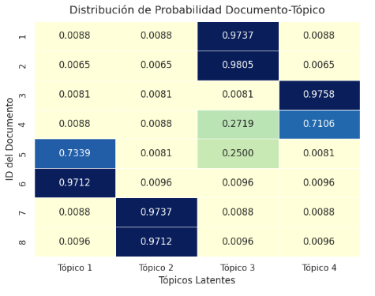

# TF-IDF
Term Frequency - Inverse Document Frequency

## ¿Qué es TF-IDF?

:::::: columns
::: {.column width="58%"}
**TF-IDF** es una técnica de minería de texto que mide qué tan importante es una palabra dentro de un documento, comparándola con los demás documentos de una colección.

Convierte texto en **valores numéricos**, lo que permite analizar documentos con algoritmos de minería de datos y aprendizaje automático.
:::

:::: {.column width="42%"}
::: formula-card
**TF-IDF**

`TF` = Frecuencia del término\
`IDF` = Frecuencia inversa en documentos
:::
::::
::::::

------------------------------------------------------------------------

## ¿Qué problema resuelve?

Si solo contamos frecuencia, podemos pensar que la palabra más repetida siempre es la más importante.

Pero eso no siempre es cierto:

::: problem-box
Una palabra puede aparecer muchas veces porque es común en todos los textos, no porque describa bien un documento específico.
:::


------------------------------------------------------------------------

## Idea principal

TF-IDF no busca solo la palabra más repetida.

Busca la palabra que mejor representa a un documento frente a los demás.

:::::::: equation-flow
::: flow-item
Aparece mucho\
en este documento
:::

::: flow-symbol
- 
:::

::: flow-item
Aparece poco\
en los demás
:::

::: flow-symbol
=
:::

::: {.flow-item .highlight}
Palabra\
representativa
:::
::::::::

------------------------------------------------------------------------

## TF: frecuencia del término

**TF** mide cuántas veces aparece una palabra en un documento.

Por ejemplo:

::: example-box
Si la palabra **"gasolina"** aparece muchas veces en un texto, su `TF` será alto.
:::

Una forma simple de calcularlo es:

$$TF(t,d) = \frac{\text{número de veces que aparece } t \text{ en } d}{\text{total de términos en } d}$$

------------------------------------------------------------------------

## IDF: frecuencia inversa en documentos

**IDF** mide qué tan común o rara es una palabra en toda la colección de documentos.

::: example-box
Si **"gasolina"** aparece en pocos documentos, su `IDF` será alto.
:::

Una forma común de calcularlo es:

$$IDF(t) = \log \left(\frac{N}{DF(t)}\right)$$

Donde `N` es el número total de documentos y `DF(t)` es el número de documentos que contienen el término.

------------------------------------------------------------------------

## Fórmula general

El peso final combina las dos ideas:

::: big-formula
$$TF\text{-}IDF(t,d) = TF(t,d) \times IDF(t)$$
:::

**Idea clave:** una palabra tiene mayor peso si aparece mucho en un documento, pero aparece poco en los demás.

------------------------------------------------------------------------

## Ejemplo: Tweets de Politica {.smaller}

Primero se parte del texto completamente crudo.

::: compact-doc-table
| ID | Documento |
|----------------------------------------:|-------------------------------|
| 1 | El presidente anunció nuevas medidas para mejorar el abasto de gasolina en varias ciudades del país. El plan de abasto incluye distribución de gasolina, supervisión de precios y coordinación con estaciones de servicio. |
| 2 | La falta de gasolina provocó largas filas en estaciones de servicio durante la mañana. En varias estaciones las filas crecieron porque la gasolina llegó tarde y los conductores esperaron durante horas. |
| 3 | Universidades públicas solicitaron mayor presupuesto para investigación, educación y becas estudiantiles. Los rectores señalaron que el presupuesto universitario sostiene laboratorios, proyectos de investigación y programas de becas. |
| 4 | El presupuesto nacional contempla apoyos para universidades, hospitales y programas sociales. La propuesta de presupuesto aumenta recursos para hospitales públicos, becas sociales y programas de atención comunitaria. |
| 5 | La Guardia Nacional reforzó la seguridad en carreteras y zonas con reportes de robo de combustible. El operativo de seguridad vigila carreteras, ductos y estaciones para reducir el robo de gasolina. |
:::

------------------------------------------------------------------------

## Ejemplo: Tweets de Politica {.smaller}

::: compact-doc-table
| ID | Documento |
|----------------------------------------:|-------------------------------|
| 6 | Trump defendió la construcción del muro fronterizo durante un discurso ante sus simpatizantes. En el discurso, Trump insistió en que el muro fronterizo era necesario para controlar la migración. |
| 7 | El gobierno mexicano respondió a las declaraciones de Trump sobre migración y seguridad fronteriza. La respuesta del gobierno señaló que la migración debe atenderse con cooperación, seguridad fronteriza y diálogo diplomático. |
| 8 | Estudiantes universitarios protestaron por recortes al presupuesto de educación pública. La protesta estudiantil exigió más presupuesto, becas, investigación y apoyo para universidades públicas. |
| 9 | Autoridades investigan una red dedicada al robo de gasolina en ductos del centro del país. La investigación ubicó ductos clandestinos, venta ilegal de gasolina y vehículos usados para transportar combustible robado. |
| 10 | El presidente se reunió con rectores para discutir presupuesto, investigación y desarrollo tecnológico. En la reunión se habló de presupuesto universitario, proyectos de investigación, innovación tecnológica y becas para estudiantes. |
:::

------------------------------------------------------------------------

## Palabras poco útiles

Antes de calcular pesos, se eliminan palabras que aparecen mucho pero aportan poco significado.

::::: columns
::: {.column width="50%"}
**Ejemplos del corpus**

- el
- la
- de
- del
- en
- y
:::

::: {.column width="50%"}
**¿Por qué eliminarlas?**

Estas palabras ayudan a construir frases, pero no suelen distinguir un documento de otro.

Si no se eliminan, pueden ocupar espacio en la matriz sin explicar realmente el contenido.
:::
:::::

------------------------------------------------------------------------

## Después de limpiar: términos candidatos

El texto se queda con palabras y frases más informativas.

| Documento | Antes | Después de limpiar |
|---------------------------:|----------------------|----------------------|
| 2 | La falta de gasolina provocó largas filas en estaciones de servicio... | falta, gasolina, filas, estaciones, gasolina, tarde, conductores, horas |
| 3 | Universidades públicas solicitaron mayor presupuesto para investigación... | universidades, públicas, presupuesto, investigación, becas, rectores, laboratorios |
| 6 | Trump defendió la construcción del muro fronterizo durante un discurso... | trump, defendió, construcción, muro, fronterizo, discurso, migración |

Aquí todavía no hay importancia: solo tenemos términos listos para ponderar.

# Ejecucion del Ejemplo


## Resultados TF-IDF: documento 2

::: example-box
La falta de gasolina provocó largas filas en estaciones de servicio durante la mañana. En varias estaciones las filas crecieron porque la gasolina llegó tarde y los conductores esperaron durante horas.
:::

| Término           |   TF-IDF |
|-------------------|---------:|
| filas             | 0.282687 |
| estaciones        | 0.210243 |
| gasolina          | 0.186921 |
| tarde conductores | 0.166960 |
| tarde             | 0.166960 |

------------------------------------------------------------------------

## Resultados TF-IDF: documento 3

::: example-box
Universidades públicas solicitaron mayor presupuesto para investigación, educación y becas estudiantiles. Los rectores señalaron que el presupuesto universitario sostiene laboratorios, proyectos de investigación y programas de becas.
:::

| Término               |   TF-IDF |
|-----------------------|---------:|
| investigación         | 0.199350 |
| presupuesto           | 0.199350 |
| becas                 | 0.199350 |
| sostiene laboratorios | 0.178061 |
| solicitaron mayor     | 0.178061 |

------------------------------------------------------------------------

## Resultados TF-IDF: documento 6

::: example-box
Trump defendió la construcción del muro fronterizo durante un discurso ante sus simpatizantes. En el discurso, Trump insistió en que el muro fronterizo era necesario para controlar la migración.
:::

| Término         |   TF-IDF |
|-----------------|---------:|
| discurso        | 0.298094 |
| muro fronterizo | 0.298094 |
| muro            | 0.298094 |
| fronterizo      | 0.298094 |
| trump           | 0.253407 |

------------------------------------------------------------------------

## Qué nos dicen las ponderaciones

Una ponderación en TF-IDF no dice si una palabra es "buena" o "mala", nos dice qué tan útil es ese término para **describir un documento específico** dentro de una colección. El valor sube cuando se combinan varias cosas:

:::::: interpretation-grid
::: interpret-card
**Frecuencia local**

El término aparece varias veces dentro del mismo documento.
:::

::: interpret-card
**Rareza global**

El término no aparece en muchos documentos de la colección.
:::

::: interpret-card
**Diferenciación**

El término ayuda a separar ese documento de los demás.
:::
::::::

**Idea clave:** Un peso alto significa que esa palabra caracteriza bien a ese documento frente al resto.

------------------------------------------------------------------------

## Lo que TF-IDF no hace por sí solo

TF-IDF genera **ponderaciones numéricas**, pero no interpreta automáticamente el significado completo del texto.

No hace por sí solo:

::: incremental
- Clasificación de temas.
- Agrupamiento de documentos.
- Detección semántica profunda.
- Comprensión del contexto como lo haría un modelo de lenguaje.
:::

------------------------------------------------------------------------

## ¿Para qué se usa después?

Los pesos TF-IDF pueden alimentar otros modelos o tareas:

::::: columns
::: {.column width="50%"}
- Clasificación de documentos.
- Búsqueda de similitud.
- Sistemas de recomendación.
:::

::: {.column width="50%"}
- Agrupamiento de textos.
- Extracción de palabras clave.
- Detección de temas.
:::
:::::

# Análisis de tópicos

## Motivación 

Una de las preguntas más simples, pero más importantes a la hora de leer y extraer información de un texto: ¿De qué trata el texto que leí?

Cuando estamos manejando una gran cantidad de textos, casi siempre urge la necesidad de agrupar grandes cantidades de datos en grupos que junten los datos más parecidos entre si. En manejo de textos, ¿Qué mejor que agrupar dichos textos en sus temas centrales?

El análisis de tópicos es un caso particular de los recursos vistos con anterioridad. La frecuencia de patrones en los textos se usan para armar agrupamientos arbitrarios en los que agrupar los textos.

## ¿Qué es un tópico? 


Se define a un tópico como el tema de una conversación o una discusión. En este caso del procesado de textos, cuando hablemos de tópicos nos referiremos al tema del que trata un texto.

## Construir un asignador de tópicos 

**Consideraciones**

En casos reales, los textos no tienen solo un tópico, tienen varios.

Los textos no siempre están limpios; todo está bien mal "escribido".

Al ser esto una introducción al análisis de tópicos, tomamos un ejemplo simple y se omite un paso no tan pedagógicamente importante.

## Escenario de ejemplo: página de tutoriales {.topic-compact .topic-table-slide}

Una página web de tutoriales quiere clasificar sus guías en 4 categorías: **Recetas de cocina**, **papiroflexia**, **alfarería** y **carpintería**. Esta página cuenta con todos sus documentos en el mismo formato y sin ningún error ortográfico, ya que se lleva a cabo un proceso de revisión antes de la publicación de tutoriales.

|  |  |
|----|----|
| id_texto | texto |
| 1 | La receta de reposteria indica batir harina para el pastel. Mete el pastel al horno para terminar la receta. |
| 2 | Esta receta de chocolate lleva harina en el pastel. Calienta el pastel en el horno para tu receta. |
| 3 | El origami consiste en realizar un pliegue en el papel. Cada pliegue de papel genera una figura de origami. |
| 4 | Para el origami asiatico el pliegue de papel es vital. Arma una figura de papel usando el origami. |
| 5 | La ceramica artesanal usa arcilla en el torno. Tornea la arcilla para hacer una vasija de ceramica. |
| 6 | Trabajar la ceramica requiere poner arcilla sobre el torno. Gira el torno con arcilla y obtendras tu vasija de ceramica. |
| 7 | La carpinteria trabaja la madera del tablon. Corta el tablon de madera para construir el mueble de carpinteria. |
| 8 | En la carpinteria lijas la madera de cada tablon. Arma el mueble de madera en tu taller de carpinteria. |

## Preprocesado {.topic-compact .topic-table-slide}

Antes de hacer nuestro modelo, debemos de deshacernos de las cosas indeseables.

**Párrafos/Saltos de línea/caracteres especiales:** Ninguno nos revela nada acerca del texto

**Stopwords:** Palabras que le dan sentido al texto al conjugarse con otras palabras, pero solas no tienen sentido

Después del "podado" de cosas indeseables tenemos

|  |  |
|----|----|
| id_texto | texto_limpio |
| 1 | receta reposteria principal batir azucar harina pastel pastel dulce requiere hornear horno terminar receta |
| 2 | receta dulce chocolate debes mezclar azucar harina pastel prepara pastel dulce procede hornear horno receta |
| 3 | origami exige precision cada doblez papel realiza pliegue papel formar figura papiroflexia origami |
| 4 | papiroflexia cada doblez papel importante pliegue papel forma figura perfecta origami papiroflexia |
| 5 | alfareria artesanal debes moldear arcilla torno ceramica ayuda moldear arcilla formar vasija alfareria |
| 6 | moldear ceramica necesita paciencia torno arcilla usa alfareria moldear vasija ceramica |
| 7 | carpinteria necesitas madera pino tablon utiliza martillo madera armar mueble carpinteria |
| 8 | construye mueble madera habitacion carpinteria debes lijar tablon madera mueble |

## Extracción de palabras puras

Hacemos un DTM (una matriz con todas las incidencias de una palabra sobre todos los textos) y extraemos las columnas para saber todas las palabras usadas en los textos.

**En el ejemplo tenemos 47 palabras puras.**

## Función LDA 

Es un método que nos permite hacer la agrupación de textos desde 0.

Recibe todas las palabras puras únicas que se recopilaron, además de recibir como parámetro una K que es el número de categorías.

LDA asigna "pesos" (la probabilidad de que si una palabra reside en un texto cualquiera, este pertenezca a la categoría "X") aleatorios en las palabras.

## ¿Cómo aprende LDA? {.topic-compact .topic-code-slide}

Pasa palabra por palabra, documento por documento, recalculando probabilidades. Se pregunta: ¿Qué tan común es este tópico en este tutorial? y ¿Qué tan común es esta palabra en este tópico?.

Repite este escaneo miles de veces hasta que las palabras se agrupan de forma lógica. En nuestro ejemplo: Las palabras de cocina se atraen entre sí, las de papiroflexia hacen lo mismo, y las categorías se vuelven nítidas.

Además, se puede configurar tanto el **número de pasadas** que se le darán a los textos para ajustar los pesos, una **semilla** que haga la asignación de pesos inicial a las palabras, y la **forma de análisis** de los textos, siendo `batch` un análisis completo de todo el lote de información, mientras que `online` lo hace por partes.

### En nuestro ejemplo ... 

``` python
        n_components=k,
        learning_method="batch",  # Evalúa todo el dataset de golpe 
        max_iter=1000,            # Asegura iteraciones suficientes para estabilizar probabilidades
        random_state=42,          # Semilla 
```

## Aplicar LDA al ejemplo

Al aplicar esto a nuestro ejemplo, podemos extraer datos útiles, como revelar cuáles fueron las palabras más relevantes para asignar tópico.

| Tópico | Palabras relevantes |
|----|----|
| Tópico 1 (Alfarería) | moldear, ceramica, arcilla, alfareria, vasija |
| Tópico 2 (Carpintería) | madera, carpinteria, mueble, tablon, debes |
| Tópico 3 (Recetas de cocina) |  receta, pastel, dulce, harina, horno |
| Tópico 4 (Papiroflexia) | papel, origami, papiroflexia, pliegue, figura |

## ¿A qué tópico pertenecen nuestros textos? {.topic-compact .topic-table-slide}

|  |  |  |
|----|----|----|
| id_texto | texto | tópico |
| 1 | La receta de reposteria indica batir harina para el pastel. Mete el pastel al horno para terminar la receta. | Tópico 3 (Recetas de cocina) |
| 2 | Esta receta de chocolate lleva harina en el pastel. Calienta el pastel en el horno para tu receta. | Tópico 3 (Recetas de cocina) |
| 3 | El origami consiste en realizar un pliegue en el papel. Cada pliegue de papel genera una figura de origami. | Tópico 4 (Papiroflexia) |
| 4 | Para el origami asiatico el pliegue de papel es vital. Arma una figura de papel usando el origami. | Tópico 4 (Papiroflexia) |
| 5 | La ceramica artesanal usa arcilla en el torno. Tornea la arcilla para hacer una vasija de ceramica. | Tópico 1 (Alfarería) |
| 6 | Trabajar la ceramica requiere poner arcilla sobre el torno. Gira el torno con arcilla y obtendras tu vasija de ceramica. | Tópico 1 (Alfarería) |
| 7 | La carpinteria trabaja la madera del tablon. Corta el tablon de madera para construir el mueble de carpinteria. | Tópico 2 (Carpintería) |
| 8 | En la carpinteria lijas la madera de cada tablon. Arma el mueble de madera en tu taller de carpinteria. | Tópico 2 (Carpintería) |

## Algunos errores que se pueden presentar {.topic-compact .topic-image-slide}

**Nunca es buena idea entrenar modelos con poca información:** Pocos datos implican mayor incertidumbre para el modelo.

Pocas palabras que coincidan pueden confundir al modelo, empeora si son pocas entradas

Se puede observar en la siguiente gráfica lo certero que estaba el modelo a la hora de asignar un tópico

{.r-stretch}
